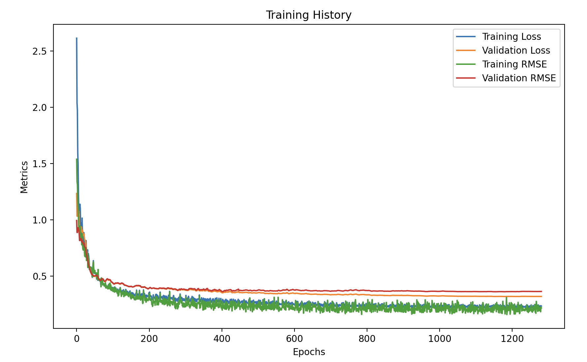

# README

## **Project Title: Student Grade Prediction Using an Artificial Neural Network (ANN)**

This project involves three key Python components designed to predict student final grades (G3) based on a range of student-related features. The system employs an Artificial Neural Network (ANN) for regression tasks and also provides a user-friendly Streamlit interface for predictions.

The project is divided into three main components:

1. **Model Training and Generation Script** (`generate_model.py`)
2. **Model Loading and Prediction Script** (`load_model_predict.py`)
3. **Interactive User Interface with Streamlit** (`streamlit_predict.py`)

---

## **1. Model Training and Generation (`generate_model.py`)**

This script builds, tunes, trains, and saves an ANN model to predict the final student grade (G3). It processes raw data, scales features, and saves both the trained model and the scalers for later use.

### **How it Works**
1. **Data Loading and Preprocessing**:
   - Loads the dataset from a CSV file.
   - Splits data into features (`X`) and target (`y`), where `y` is the final grade (G3).
   - One-hot encodes categorical features.
   - Scales features and the target using `StandardScaler`.

2. **Hyperparameter Tuning**:
   - Uses **Keras Tuner** for hyperparameter optimization.
   - Key hyperparameters tuned include:
     - **Number of Layers**: 1 to 5 hidden layers.
     - **Neurons per Layer**: 32 to 512 neurons per layer.
     - **Dropout Rate**: 0.2 to 0.5.
     - **L2 Regularization**: Between 1e-5 and 1e-2.
     - **Learning Rate**: 1e-5 to 1e-2.
   - Performs tuning using the **Hyperband** algorithm.

3. **Model Creation and Training**:
   - Builds the best ANN model architecture based on the tuning results.
   - Trains the ANN using mean squared error (MSE) as the loss function and root mean squared error (RMSE) as a metric.
   - Early stopping and learning rate reduction callbacks ensure optimal training.

4. **Saving the Model and Scalers**:
   - Saves the trained Keras model as `optimized_ann_model.h5`.
   - Saves the feature and target scalers as `feature_scaler.pkl` and `target_scaler.pkl`.
   - Saves the training column names as `training_columns.pkl`.
   - Saves hyperparameter tuning results in the `tuning_results/` directory.

### **Usage**
1. Place your CSV dataset in the specified path.
2. Run the script:
   ```bash
   python generate_model.py
   ```
3. The following files will be saved:
   - **`optimized_ann_model.h5`**: The trained model.
   - **`feature_scaler.pkl`**: The scaler for feature inputs.
   - **`target_scaler.pkl`**: The scaler for target outputs.
   - **`training_columns.pkl`**: Training feature names to ensure correct input structure.
   - **`tuning_results/`**: Directory containing hyperparameter tuning logs and results.

---

## **2. Model Loading and Prediction (`load_model_predict.py`)**

This script loads the saved ANN model, processes input feature data, and predicts the final grade (G3).

### **How it Works**
1. **Loading the Model and Scalers**:
   - Loads the previously trained ANN model (`optimized_ann_model.h5`).
   - Loads the feature scaler (`feature_scaler.pkl`), target scaler (`target_scaler.pkl`), and training column names (`training_columns.pkl`).

2. **Input Handling**:
   - Accepts user input as a dictionary of feature values.
   - Ensures compatibility with saved training columns by reindexing the input.
   - Missing or unused columns are filled with zeros.

3. **Prediction**:
   - Scales the input features using the feature scaler.
   - Predicts the scaled output using the model.
   - Inversely scales the predicted G3 value to obtain the actual predicted grade.

4. **Debugging Improvements**:
   - Added warnings for input validation issues (e.g., NaN or all-zero inputs).
   - Enhanced error handling during model loading and prediction steps.
   - Added detailed debug logs for scaled inputs and predictions.

### **Usage**

To use the model as is visit https://grade-predictor-5ztnvbxweavguai9xrnwsu.streamlit.app/ .

1. Ensure the `optimized_ann_model.h5`, `feature_scaler.pkl`, `target_scaler.pkl`, and `training_columns.pkl` files are present.
2. Modify the `example_input` dictionary in the script to test with custom feature values.
3. Run the script:
   ```bash
   python load_model_predict.py
   ```
4. Example output:
   ```
   Predicted G3 value: 12.34
   ```

---

## **3. Streamlit-Based User Interface (`streamlit_app.py`)**

This script provides an interactive web-based interface for users to input student data and predict the final grade (G3) using the trained model.

### **How it Works**
1. **Interactive UI**:
   - Users enter student information via sliders, dropdowns, and select boxes.
   - Inputs include features like age, grades (G1, G2), study time, family relationships, alcohol consumption, absences, and more.

2. **Input Validation and Handling**:
   - Ensures inputs match the columns used during model training.
   - Missing keys are filled with zero to avoid errors.

3. **Model Prediction**:
   - Loads the trained model and scalers.
   - Predicts the final grade (G3) based on user input.
   - Displays the predicted grade with a success message.

### **How to Run the Streamlit App**
1. Ensure all necessary files (`optimized_ann_model.h5`, `feature_scaler.pkl`, `target_scaler.pkl`, `training_columns.pkl`) are in the project directory.
2. Run the Streamlit script using the following command:
   ```bash
   streamlit run streamlit_app.py
   ```
3. Open the provided URL in a browser (e.g., `http://localhost:8501`).
4. Enter the required student data and click "Predict Final Grade (G3)".

---

## **File Structure**
```
project_directory/
  ├── generate_model.py         # Script to train and save the model and scalers
  ├── load_model_predict.py     # Script to load the model and make predictions
  ├── streamlit_app.py      # Streamlit-based user interface for predictions
  ├── optimized_ann_model.h5    # Saved optimized model file
  ├── feature_scaler.pkl        # Saved feature scaler
  ├── target_scaler.pkl         # Saved target scaler
  ├── training_columns.pkl      # Saved training column names
  ├── tuning_results/           # Directory for hyperparameter tuning results
  └── student_data/
      └── student-mat.csv       # Dataset file (not included, must be provided)
```

---

## **Results**
### Model Performance Metrics:
- **Test RMSE**: 2.0314
- **Test MAE**: 1.0590
- **Test R2**: 0.4849

### Hyperparameter Tuning:
- **Best Hyperparameters Found**:
  - Number of Layers: 3
  - Neurons per Layer: 128, 256, 128
  - Dropout Rate: 0.3
  - L2 Regularization: 0.0001
  - Learning Rate: 0.001

### Training Details:
- **Restoring model weights from the end of the best epoch**: 1181.

### Training History Plot:


---

## **Dataset Information**
This project uses the following dataset:
- **Cortez, P. (2008). Student Performance [Dataset]. UCI Machine Learning Repository.**
  [https://doi.org/10.24432/C5TG7T](https://doi.org/10.24432/C5TG7T)

This dataset contains information on student demographics, social life, and academic factors that influence their final grade (G3).

---

## **Customization**
You can modify the following aspects to suit your needs:
- **Data Preprocessing**: Adjust the target variable or add more features.
- **Hyperparameter Tuning**: Adjust tuning parameters in the `Hyperband` configuration.
- **ANN Architecture**: Modify the number of layers, neurons, dropout, and activation functions in the `create_model()` function.
- **Streamlit Interface**: Add/remove input fields or enhance the UI.
- **Training Settings**: Fine-tune the training configuration, such as learning rate schedules, batch size, or callback mechanisms.v


## **Contact**
Please contact me for any queries and improvements, it will be a delight to hear form you.

Hope you have a blissfull coding session.

